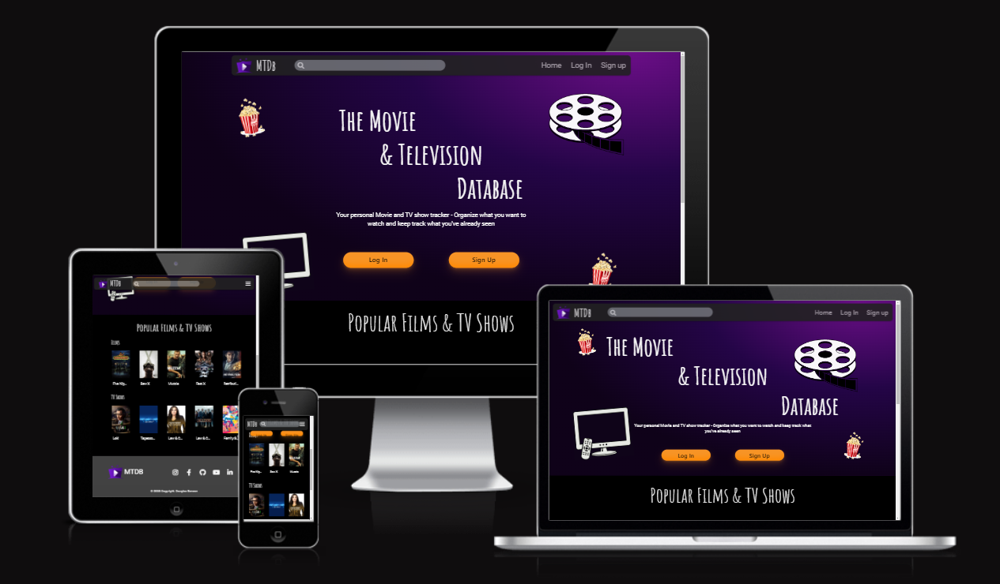
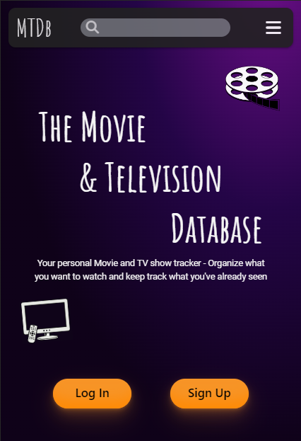
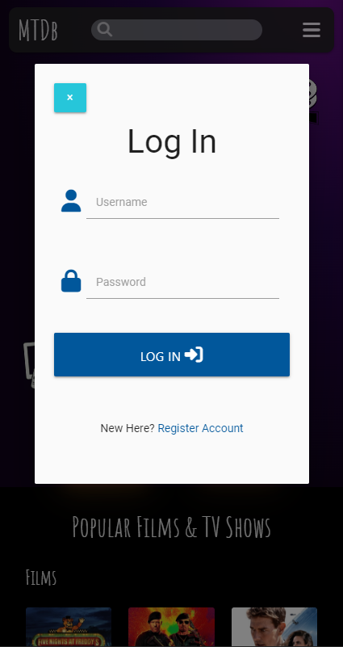
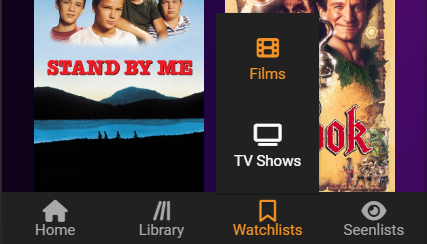
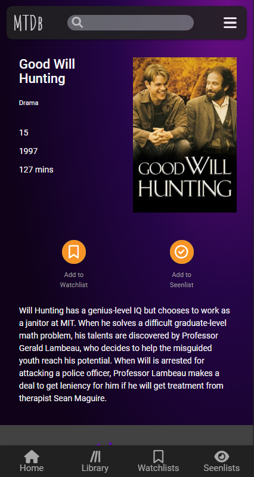

# MTDB - MOVIE & TELEVISION DATABASE

Introducing MTDB - the Movie & Television Database, your ultimate solution for keeping track of what to watch next and what you've already seen. Say goodbye to forgetting movie recommendations or losing track of TV show progress. MTDB makes it effortless to create a list of films and shows you're excited to watch and organize the ones you've already enjoyed.

MTDB is designed for all entertainment enthusiasts. Whether you're a movie buff, a TV show addict, or just someone who enjoys the occasional flick, MTDB is here to make your life easier. Create your personal watchlist, rate what you've seen, and get tailored recommendations based on your preferences. No more scrolling through endless options – MTDB helps you decide what's worth your time.



[View the live site here.](https://mtdb-movie-television-database-ff116cae015a.herokuapp.com/)

## UX

The Homepage's main function will be to attract new users to register an account and for existing users to log in. So sign-up and log in options will be in clear eyesight as soon as the page is opened. Some extra functionality will be the ability to search for a movie or show log-inhe nav bar without first logging in or signing up. Once a search result is found an option will be presented to log-in a watchlist or seen list. If either of these buttons are clicked the user will be promted to log in or sign up.

Once the user is logged in they will be presented with a library of all the movies and shows saved to their lists. From here they can select the individual lists available to them or select an item from the full library, where they are given the ability to move the item between lists, give it a rating, add personal comments or delete the item.

### Colour Scheme

I have chosen a dark theme with purple highlights as I feel this best represented the 'Movie' experience. For the majority of the text I have selected a white color as this popped out more and makes the experience better for the user.

- `#F5F5F5` used for primary text.
- `#F79426` used for primary highlights and buttons.
- `#6B0E87` used for background colours.
- `#000000` used for secondary background colours.
- `#FF0000` used for buttons that have a permanent action.
- `#4CAF50` used for 'safe' buttons.

I used [coolors.co](https://coolors.co/000000-ff0000-4caf50-6b0e87-f79426-f5f5f5) to generate my colour palette.


### Typography

- [Amatic SC](https://fonts.google.com/specimen/Amatic+SC) was used for the primary headers and titles.

- [Roboto](https://fonts.google.com/specimen/Roboto) was used for all other secondary text.

- [Font Awesome](https://fontawesome.com) icons were used throughout the site, such as the social media icons in the footer.

## User Stories

### New Site Users

- As a new site user, I would like to see clear sign-up and login options, so that I can quickly access the sites full functionality.
- As a new site user, I would like to search for movies/shows without signing up, so that I can see what the site has to offer.
- As a new site user, I would like to easily navigate through the site, so that I can quickly find exactly what I'm looking for.
- As a new site user, I would like to responsive design, so that I can view the page on multiple devices.

### Returning Site Users

- As a returning site user, I would like to easily log in, so that I can access my library and lists.
- As a returning site user, I would like to view each of my lists individually, so I can choose what to watch.
- As a returning site user, I would like to see where I can watch the movies/shows in my lists, so I can choose a streaming service to watch on.
- As a returning site user, I would like to add movies/shows to my lists, so that I can keep track of what to watch or what I have watched.
- As a returning site user, I would like to edit movies/shows in my lists, so that I can personal or correct the information already stored.
- As a returning site user, I would like to delete movies/shows from my lists, so that unwanted items are no longer displayed to me.

### Site Admin

- As a site administrator, I should be able to add or remove categories from the database, so that I can provide the user with relevant information.
- As a site administrator, I should be able to see how many people are using the site.
- As a site administrator, I should be able to ____________, so that I can ____________.
- As a site administrator, I should be able to ____________, so that I can ____________.
- As a site administrator, I should be able to ____________, so that I can ____________.

## Wireframes

To follow best practices, wireframes were developed for mobile, tablet, and desktop sizes.
I've used [Balsamiq](https://balsamiq.com/wireframes) to design my site wireframes.

### Mobile Wireframes

<details>
<summary>Click here to see the Mobile Wireframes</summary>

- Home Page
  - 
- Library Page
  - 
- Search Result Page
  - 
- Existing List Item Page
  - 

</details>

### Tablet Wireframes

<details>
<summary>Click here to see the Tablet Wireframes</summary>

- Home Page
  - 
- Library Page
  - 
- Search Result Page
  - 
- Existing List Item Page
  - 

</details>

### Desktop Wireframes

<details>
<summary>Click here to see the Desktop Wireframes</summary>

- Home Page
  - 
- Library Page
  - 
- Search Result Page
  - 
- Existing List Item Page
  - 

</details>


## Features

### Existing Features

- **Navbar**
    - A simple navbar where the user can use the search bar to find movies and tv shows, navigate to the home page using the 'Home' link or by clicking the logo/title, navigate to the library page or log out.
    - If the user is new to the page or not yet logged in, the navbar gives the user the option to sign up or log in.


- **Welcome section**

    - A clean and simple welcome section of the home page displaying the sites full name.
    - log in and sign up buttons have been added to the welcome page to make it easy for users to see, especially when vieing on a mobile device where the navbar log in and sign up links are hidden.

 


- **Popular Films and TV Shows**

    - This section uses an API to fetch data about the most popular films and tv shows.
    - Because this uses an API these titles will constantly be updated giving the user something new to look at when visiting the site.


- **Footer**

    - Logo and title will link the user back to the homepage.
    - Social media links for the user to find out more about the site. These will open in a new tab.


- **Log In and Sign Up Modals**

    - I have choosen to have modals for the log in and sign up options instead of directing the user to a separate page. I feel this is more user friendly. For example if the user decides not to log in or sign up at that time they dont have to navigate back to the homepage.
    - If the user clicks on the wrong button by mistake there is a link at the bottom of the modal that will take the user to the correct modal.
    - To close the modal the user can either click on the 'x' button or anywhere on the screen outside of the modal.
    - Once logged in the user will be directed to their library page.

 


- **Flash message modals**

    - I chose to display the flash messages within a modal because I did not like that the flash messages appeared at the top of the screen and would  push other elements down the page.
    - Another positive of using a modal to display the flash message is that the message could be closed once the user has read it keeping the page clean and tidy.

 

 


- **Bottom and side nav**

    - Once a user has signed up and is logged in they have a variety of other options available to them. These are all displayed on the bottom nav (for mobile users) and side nav (for desktop users).
    - The user can navigate back to the home page, library page or view thier watchlists or seenlists.
    - The Watchlists and Seenlists nav options have an expandable menu which allows the user to navigate to a specific list

    


- **Search Results**

    - When the user searches for a title in the search bar this page will be loaded.
    - The API is access once again to find the details of the search title and are diplayed here for the user
    - The user does not have to be logged in to search for a title. But if they try to add the title to one of the lists, non registered users will be warned that they must be logged in to perform the action.

  

- **Feature Details**

    - This page is only available to session users. It is accessed by clicking one of the titles that have been added to the users lists.
    - This page allows the user to change which list the title is in. If the user trys to add the title to a list that it is already in a modal flash message will promt the user.
    - Users can delete titles from thier lists witht the delete/trash button. A modal prompt will be shown to the user to confirm if they want to delete (see below).
    - Users can add thier own star rating from 1 to 5 stars.
    - Personal review or comments can also be added for each title.

    

- **Poster menu options**

    - Each poster has an expandable menu accesed by clicking the three vertical dots.
    - This menu gives the user options to delete the title from the list or edit. choosing edit will direct the user to the feature details page.


- **Delete modal prompt**

    - This modal prompt is displayed whenever a user try's to delete a title.
    - This is to capture any accidental clicks of the delete button.


- **404 page**

    - This page displays when the user tries to navigate to a page that doesn't exist.
    - The page will refresh to the homepage after 10 seconds.


### Future Features

- Autocomplete list for search bar
    - This feature will access the API as the user types and will display the closest matches in a dropdown list. This list will display the titles and the posters for all closest matches
- Where to watch
    - This will access an API that return information on what streaming services the currently viewed title can be watch on.
- Ratings from external sources
    - This will also access an API to gather the ratings or scores that have been given by other platforms such as imdb.com and rottentomatoes.com

## Tools & Technologies Used

- [HTML](https://en.wikipedia.org/wiki/HTML) used for the main site content.
- [CSS](https://en.wikipedia.org/wiki/CSS) used for the main site design and layout.
- [JavaScript](https://www.javascript.com) used for user interaction on the site.
- [Python](https://www.python.org) used as the back-end programming language.
- [Git](https://git-scm.com) used for version control. (`git add`, `git commit`, `git push`)
- [GitHub](https://github.com) used for secure online code storage.
- [Gitpod](https://gitpod.io) used as a cloud-based IDE for development.
- [Materialize](https://materializecss.com) used as the front-end CSS framework for modern responsiveness and pre-built components.
- [Flask](https://flask.palletsprojects.com) used as the Python framework for the site.
- [MongoDB](https://www.mongodb.com) used as the non-relational database management with Flask.
- [Heroku](https://www.heroku.com) used for hosting the deployed back-end site.
- [Balsamiq](https://balsamiq.com/) used to create the project wireframes.
- [redketchup](https://redketchup.io/favicon-generator) to generate the favicon used on all pages.

## Database Design

My project uses a non-relational database with MongoDB, and therefore the database architecture
doesn't have actual relationships like a relational database would.

My database is called **mtdb**.

It contains 3 collections:

- **all_added_title**
    | Key | Type | Notes |
    | --- | --- | --- |
    | _id | ObjectId() | |
    | id | String | |
    | poster_path | String | |

- **rating_review**
    | Key | Type | Notes |
    | --- | --- | --- |
    | _id | ObjectId() | |
    | user_id | ObjectId() | |
    | feature_id | String | |
    | rating | String | |
    | review | String | |


- **users**
    | Key | Type | Notes |
    | --- | --- | --- |
    | _id | ObjectId() | |
    | username | String | |
    | password | String | uses Secure Hash Algorithm (SHA) |
    | movie_list | Array | |
    | tv_list | Array | |
    | watchlist | Array | |
    | seenlist | Array | |

## Testing

For all testing, please refer to the [TESTING.md](TESTING.md) file.

## Deployment

⚠️⚠️⚠️⚠️⚠️ START OF NOTES (to be deleted) ⚠️⚠️⚠️⚠️⚠️

**IMPORTANT:**
- Be sure to remove all instances of ElephantSQL/PostgreSQL/Flask-Migrate if you've only used a non-relational database with MongoDB
- Be sure to remove all instances of MongoDB if you've only used a relational database with ElephantSQL/PostgreSQL
- ⚠️ DO NOT update the environment variables to your own! These should NOT be included in this file; just demo values! ⚠️
- ⚠️ DO NOT update the environment variables to your own! These should NOT be included in this file; just demo values! ⚠️
- ⚠️ DO NOT update the environment variables to your own! These should NOT be included in this file; just demo values! ⚠️

🛑🛑🛑🛑🛑 END OF NOTES (to be deleted) 🛑🛑🛑🛑🛑

The live deployed application can be found deployed on [Heroku](https://mtdb-movie-television-database-ff116cae015a.herokuapp.com).

### MongoDB Non-Relational Database

This project uses [MongoDB](https://www.mongodb.com) for the Non-Relational Database.

To obtain your own MongoDB Database URI, sign-up on their site, then follow these steps:
- The name of the database on MongoDB should be called **insert-your-database-name-here**.
- The collection(s) needed for this database should be **insert-your-collection-names-here**.
- Click on the **Cluster** name created for the project.
- Click on the **Connect** button.
- Click **Connect Your Application**.
- Copy the connection string, and replace `password` with your own password (also remove the angle-brackets).

### Heroku Deployment

This project uses [Heroku](https://www.heroku.com), a platform as a service (PaaS) that enables developers to build, run, and operate applications entirely in the cloud.

Deployment steps are as follows, after account setup:

- Select **New** in the top-right corner of your Heroku Dashboard, and select **Create new app** from the dropdown menu.
- Your app name must be unique, and then choose a region closest to you (EU or USA), and finally, select **Create App**.
- From the new app **Settings**, click **Reveal Config Vars**, and set your environment variables.

| Key | Value |
| --- | --- |
| `DATABASE_URL` | user's own value |
| `IP` | 0.0.0.0 |
| `MONGO_DBNAME` | user's own value |
| `MONGO_URI` | user's own value |
| `PORT` | 5000 |
| `SECRET_KEY` | user's own value |

Heroku needs two additional files in order to deploy properly.
- requirements.txt
- Procfile

You can install this project's **requirements** (where applicable) using:
- `pip3 install -r requirements.txt`

If you have your own packages that have been installed, then the requirements file needs updated using:
- `pip3 freeze --local > requirements.txt`

The **Procfile** can be created with the following command:
- `echo web: python app.py > Procfile`
- *replace **app.py** with the name of your primary Flask app name; the one at the root-level*

For Heroku deployment, follow these steps to connect your own GitHub repository to the newly created app:

Either:
- Select **Automatic Deployment** from the Heroku app.

Or:
- In the Terminal/CLI, connect to Heroku using this command: `heroku login -i`
- Set the remote for Heroku: `heroku git:remote -a app_name` (replace *app_name* with your app name)
- After performing the standard Git `add`, `commit`, and `push` to GitHub, you can now type:
	- `git push heroku main`

The project should now be connected and deployed to Heroku!

### Local Deployment

This project can be cloned or forked in order to make a local copy on your own system.

For either method, you will need to install any applicable packages found within the *requirements.txt* file.
- `pip3 install -r requirements.txt`.

You will need to create a new file called `env.py` at the root-level,
and include the same environment variables listed above from the Heroku deployment steps, plus a few extras.

Sample `env.py` file:

```python
import os

os.environ.setdefault("IP", "0.0.0.0")
os.environ.setdefault("MONGO_DBNAME", "user's own value")
os.environ.setdefault("MONGO_URI", "user's own value")
os.environ.setdefault("PORT", "5000")
os.environ.setdefault("SECRET_KEY", "user's own value")

# local environment only (do not include these in production/deployment!)
os.environ.setdefault("DB_URL", "user's own value")
os.environ.setdefault("DEBUG", "True")
os.environ.setdefault("DEVELOPMENT", "True")
```

#### Cloning

You can clone the repository by following these steps:

1. Go to the [GitHub repository](https://github.com/dougyb83/MTDb-Movie-Television-Database) 
2. Locate the Code button above the list of files and click it 
3. Select if you prefer to clone using HTTPS, SSH, or GitHub CLI and click the copy button to copy the URL to your clipboard
4. Open Git shell or Terminal
5. Change the current working directory to the one where you want the cloned directory
6. In your IDE Terminal, type the following command to clone my repository:
	- `git clone https://github.com/dougyb83/MTDb-Movie-Television-Database.git`
7. Press Enter to create your local clone.

Alternatively, if using Gitpod, you can click below to create your own workspace using this repository.

[](https://gitpod.io/#https://github.com/dougyb83/MTDb-Movie-Television-Database)

Please note that in order to directly open the project in Gitpod, you need to have the browser extension installed.
A tutorial on how to do that can be found [here](https://www.gitpod.io/docs/configure/user-settings/browser-extension).

#### Forking

By forking the GitHub Repository, we make a copy of the original repository on our GitHub account to view and/or make changes without affecting the original owner's repository.
You can fork this repository by using the following steps:

1. Log in to GitHub and locate the [GitHub Repository](https://github.com/dougyb83/MTDb-Movie-Television-Database)
2. At the top of the Repository (not top of page) just above the "Settings" Button on the menu, locate the "Fork" Button.
3. Once clicked, you should now have a copy of the original repository in your own GitHub account!

### Local VS Deployment

⚠️⚠️⚠️⚠️⚠️ START OF NOTES (to be deleted) ⚠️⚠️⚠️⚠️⚠️

Use this space to discuss any differences between the local version you've developed, and the live deployment site on Heroku.

🛑🛑🛑🛑🛑 END OF NOTES (to be deleted) 🛑🛑🛑🛑🛑

## Credits

⚠️⚠️⚠️⚠️⚠️ START OF NOTES (to be deleted) ⚠️⚠️⚠️⚠️⚠️

In this section you need to reference where you got your content, media, and extra help from.
It is common practice to use code from other repositories and tutorials,
however, it is important to be very specific about these sources to avoid plagiarism.

🛑🛑🛑🛑🛑 END OF NOTES (to be deleted) 🛑🛑🛑🛑🛑

### Content

⚠️⚠️⚠️⚠️⚠️ START OF NOTES (to be deleted) ⚠️⚠️⚠️⚠️⚠️

Use this space to provide attribution links to any borrowed code snippets, elements, or resources.
A few examples have been provided below to give you some ideas.

Ideally, you should provide an actual link to every resource used, not just a generic link to the main site!

🛑🛑🛑🛑🛑 END OF NOTES (to be deleted) 🛑🛑🛑🛑🛑

| Source | Location | Notes |
| --- | --- | --- |
| [Markdown Builder](https://tim.2bn.dev/markdown-builder/) | README and TESTING | tool to help generate the Markdown files |
| [Chris Beams](https://chris.beams.io/posts/git-commit) | version control | "How to Write a Git Commit Message" |
| [W3Schools](https://www.w3schools.com/howto/howto_js_topnav_responsive.asp) | entire site | responsive HTML/CSS/JS navbar |
| [W3Schools](https://www.w3schools.com/howto/howto_css_modals.asp) | contact page | interactive pop-up (modal) |
| [W3Schools](https://www.w3schools.com/css/css3_variables.asp) | entire site | how to use CSS :root variables |
| [Flexbox Froggy](https://flexboxfroggy.com/) | entire site | modern responsive layouts |
| [Grid Garden](https://cssgridgarden.com) | entire site | modern responsive layouts |
| [StackOverflow](https://stackoverflow.com/a/2450976) | quiz page | Fisher-Yates/Knuth shuffle in JS |
| [YouTube](https://www.youtube.com/watch?v=YL1F4dCUlLc) | leaderboard | using `localStorage()` in JS for high scores |
| [YouTube](https://www.youtube.com/watch?v=u51Zjlnui4Y) | PP3 terminal | tutorial for adding color to the Python terminal |
| [strftime](https://strftime.org) | CRUD functionality | helpful tool to format date/time from string |
| [WhiteNoise](http://whitenoise.evans.io) | entire site | hosting static files on Heroku temporarily |

### Media

⚠️⚠️⚠️⚠️⚠️ START OF NOTES (to be deleted) ⚠️⚠️⚠️⚠️⚠️

Use this space to provide attribution links to any images, videos, or audio files borrowed from online.
A few examples have been provided below to give you some ideas.

If you're the owner (or a close acquaintance) of all media files, then make sure to specify this.
Let the assessors know that you have explicit rights to use the media files within your project.

Ideally, you should provide an actual link to every media file used, not just a generic link to the main site!
The list below is by no means exhaustive. Within the Code Institute Slack community, you can find more "free media" links
by sending yourself the following command: `!freemedia`.

🛑🛑🛑🛑🛑 END OF NOTES (to be deleted) 🛑🛑🛑🛑🛑

| Source | Location | Type | Notes |
| --- | --- | --- | --- |
| [Pexels](https://www.pexels.com) | entire site | image | favicon on all pages |
| [Lorem Picsum](https://picsum.photos) | home page | image | hero image background |
| [Unsplash](https://unsplash.com) | product page | image | sample of fake products |
| [Pixabay](https://pixabay.com) | gallery page | image | group of photos for gallery |
| [Wallhere](https://wallhere.com) | footer | image | background wallpaper image in the footer |
| [This Person Does Not Exist](https://thispersondoesnotexist.com) | testimonials | image | headshots of fake testimonial images |
| [Audio Micro](https://www.audiomicro.com/free-sound-effects) | game page | audio | free audio files to generate the game sounds |
| [Videvo](https://www.videvo.net/) | home page | video | background video on the hero section |
| [TinyPNG](https://tinypng.com) | entire site | image | tool for image compression |

### Acknowledgements

⚠️⚠️⚠️⚠️⚠️ START OF NOTES (to be deleted) ⚠️⚠️⚠️⚠️⚠️

Use this space to provide attribution to any supports that helped, encouraged, or supported you throughout the development stages of this project.
A few examples have been provided below to give you some ideas.

🛑🛑🛑🛑🛑 END OF NOTES (to be deleted) 🛑🛑🛑🛑🛑

- I would like to thank my Code Institute mentor, [Tim Nelson](https://github.com/TravelTimN) for their support throughout the development of this project.
- I would like to thank the [Code Institute](https://codeinstitute.net) tutor team for their assistance with troubleshooting and debugging some project issues.
- I would like to thank the [Code Institute Slack community](https://code-institute-room.slack.com) for the moral support; it kept me going during periods of self doubt and imposter syndrome.
- I would like to thank my partner (John/Jane), for believing in me, and allowing me to make this transition into software development.
- I would like to thank my employer, for supporting me in my career development change towards becoming a software developer.
