# Testing

Return back to the [README.md](README.md) file.

## Code Validation

### HTML

I have used the recommended [HTML W3C Validator](https://validator.w3.org) to validate all of my HTML files.

| Page | W3C URL | Screenshot | Notes |
| --- | --- | --- | --- |
| Home | [W3C](https://validator.w3.org/nu/?doc=https%3A%2F%2Fmtdb-movie-television-database-ff116cae015a.herokuapp.com%2Fhome) | 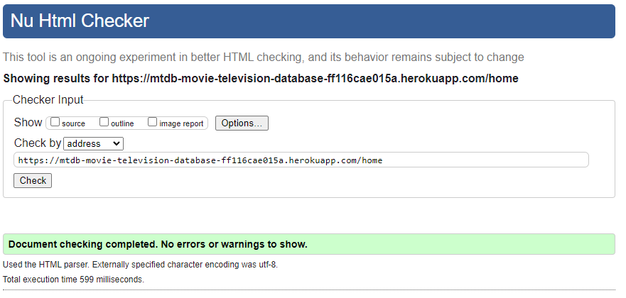 | Section lacks header h2-h6 warning |
| Home (logged in)| n/a | 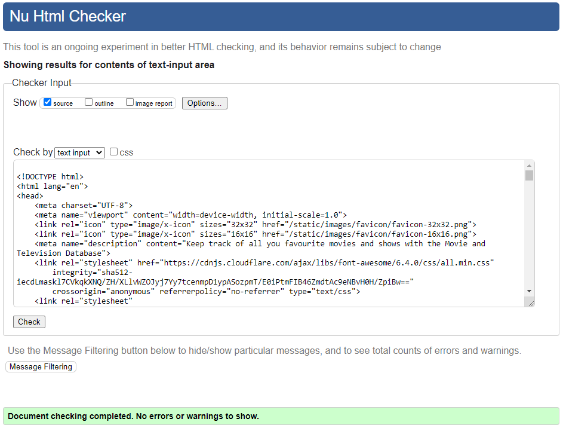 | Section lacks header h2-h6 warning |
| search-results | n/a |  | Section lacks header h2-h6 warning |
| search-results (logged in)| n/a |  | Section lacks header h2-h6 warning |
| Library | n/a | 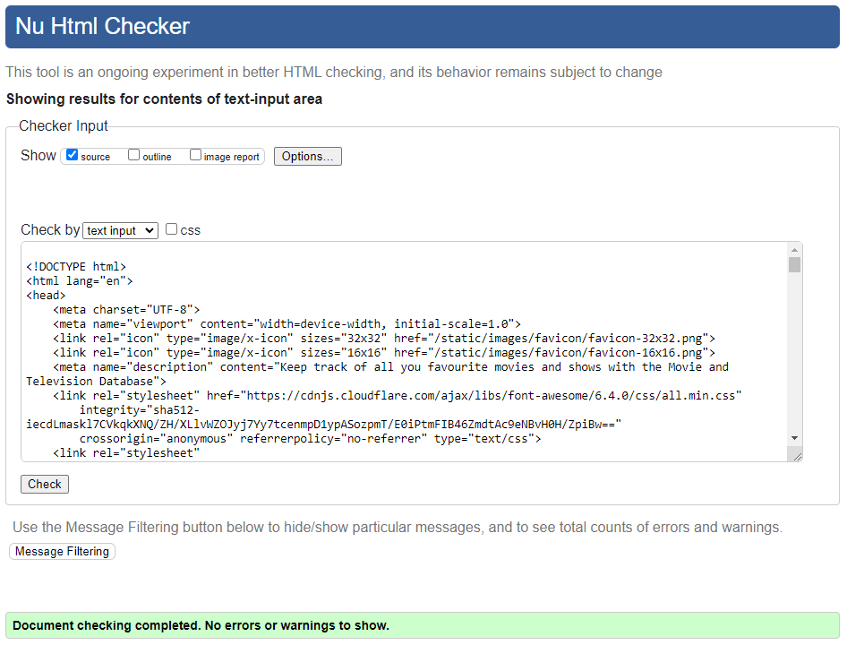 | Section lacks header h2-h6 warning |
| Feature-details | n/a | 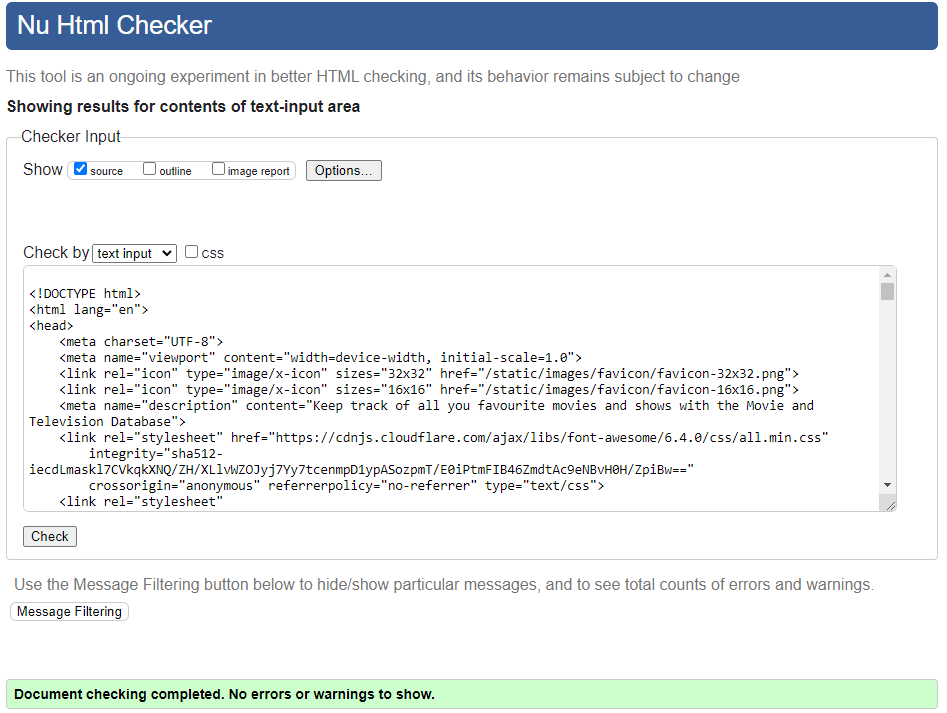 | Section lacks header h2-h6 warning |
| lists | n/a | 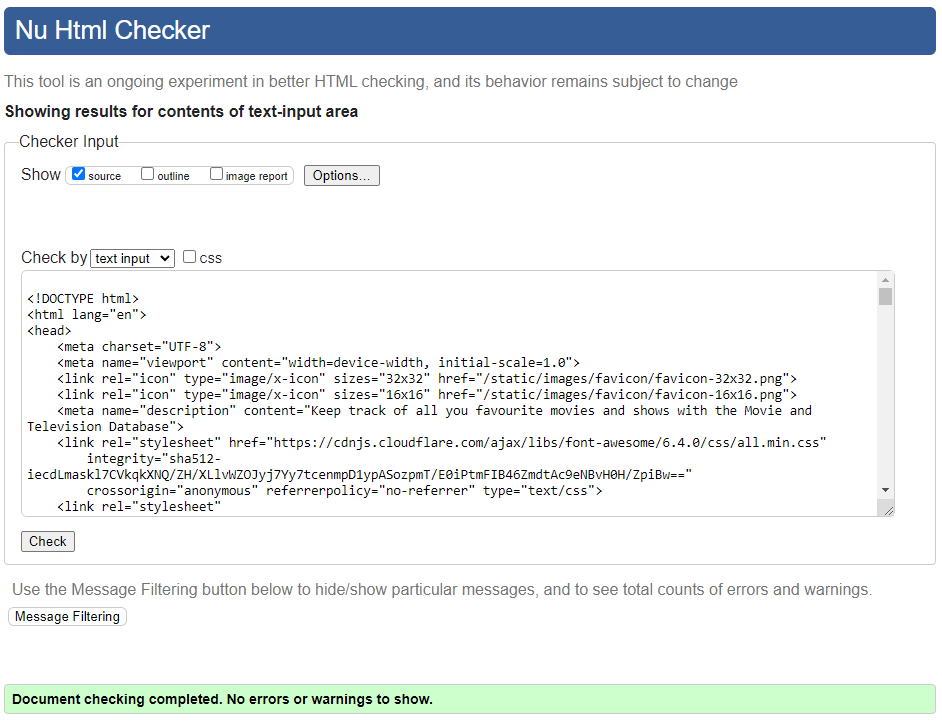 | Section lacks header h2-h6 warning |
| 404 | n/a | 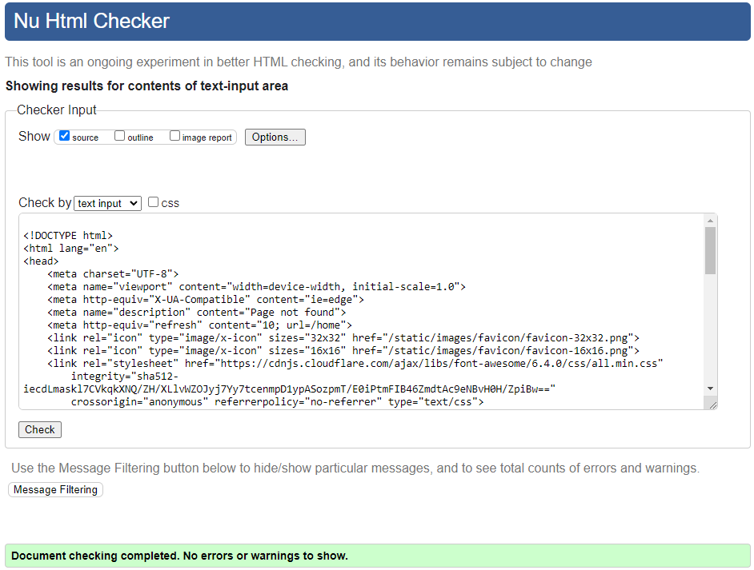 | Pass - No Errors |

### CSS

I have used the recommended [CSS Jigsaw Validator](https://jigsaw.w3.org/css-validator) to validate all of my CSS files.

| File | Jigsaw URL | Screenshot | Notes |
| --- | --- | --- | --- |
| style.css | [Jigsaw](https://jigsaw.w3.org/css-validator/validator?uri=https%3A%2F%2Fmtdb-movie-television-database-ff116cae015a.herokuapp.com%2F&profile=css3svg&usermedium=all&warning=1&vextwarning=&lang=en) | 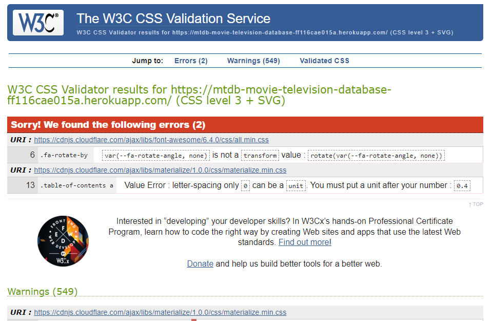 | Pass: Errors only from external sources |

### JavaScript

I have used the recommended [JShint Validator](https://jshint.com) to validate all of my JS files.

| File | Screenshot | Notes |
| --- | --- | --- |
| script.js |  | Pass: No Errors |

### Python

I have used the recommended [PEP8 CI Python Linter](https://pep8ci.herokuapp.com) to validate all of my Python files.

| File | CI URL | Screenshot | Notes |
| --- | --- | --- | --- |
| app.py | [PEP8 CI](https://pep8ci.herokuapp.com/https://raw.githubusercontent.com/dougyb83/MTDb-Movie-Television-Database/main/app.py) |  | Pass: No Errors |

## Browser Compatibility

I've tested my deployed project on multiple browsers to check for compatibility issues.

| Browser | Screenshot                                                                | Screenshot                                                                | Screenshot                                                                   | Notes                 |
| ------- | ------------------------------------------------------------------------- | ------------------------------------------------------------------------- | ---------------------------------------------------------------------------- | --------------------- |
| Chrome  |  |  |  | Works as expected |
| Firefox |  |  |  | Works as expected |
| Edge    |  |  |  | Works as expected |
| Aloha   | 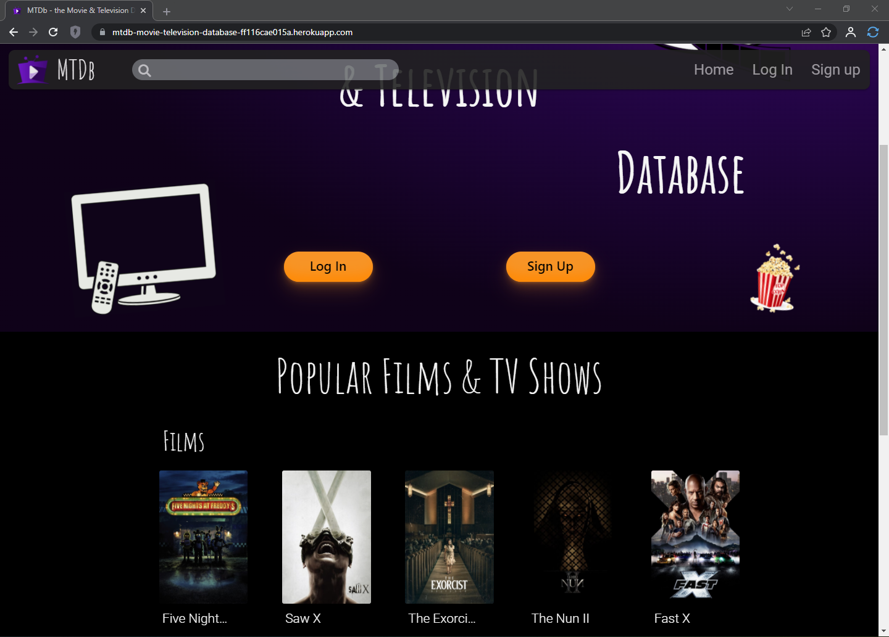 |  |  | Works as expected |
| Brave   |  |  |  | Works as expected |
| Opera   |  |  | 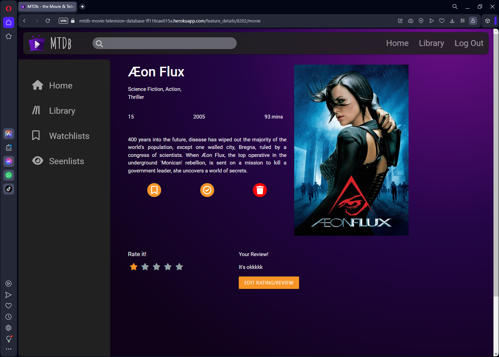 | Works as expected |

## Responsiveness

I've tested my deployed project on multiple devices to check for responsiveness issues.

I have found that in dev tools @ 425px and lower the 3 dots menu activator is not always clickable. This has been tested on more than one PC but with different results. On some PC's it works ok on others it does not.

| Device                   | Screenshot                                                          | Screenshot                                                          | Screenshot                                                             | Notes             |
| ------------------------ | ------------------------------------------------------------------- | ------------------------------------------------------------------- | ---------------------------------------------------------------------- | ----------------- |
| Iphone 12 Pro (DevTools)        |    |    | 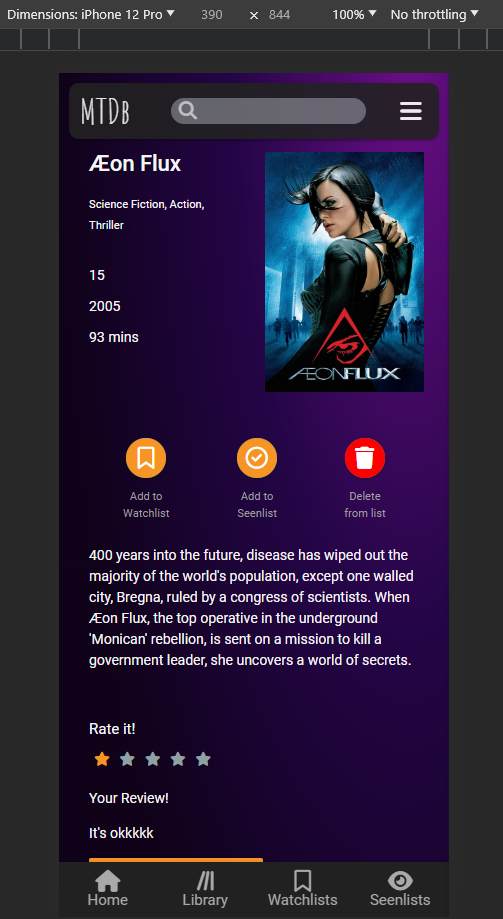   | The 3 dots menu activator is sometimes unclickable |
| Ipad Mini (DevTools)        |    |    |    | Works as expected |
| Desktop                  | 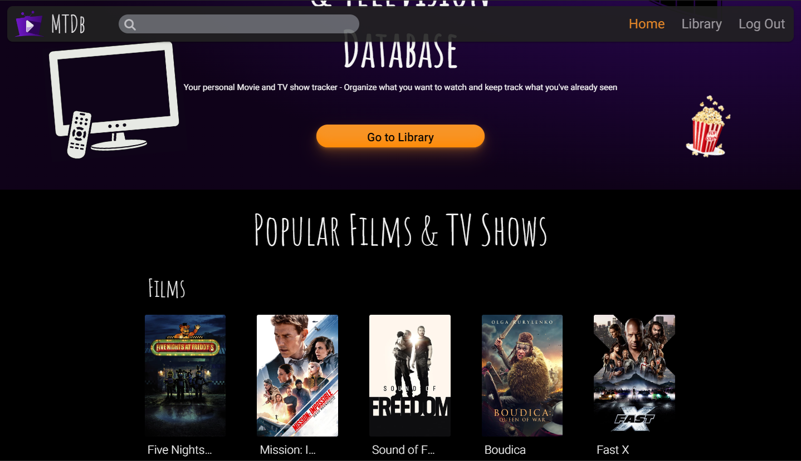      |       |       | Works as expected |
| Google Pixel 4a          | 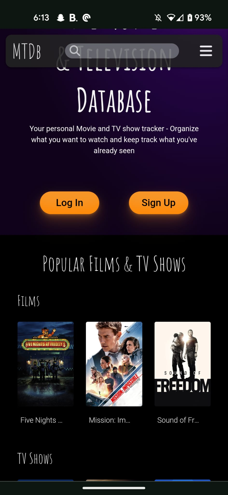 |  |  | Works as expected |
| Samsung Galaxy S8        |     | 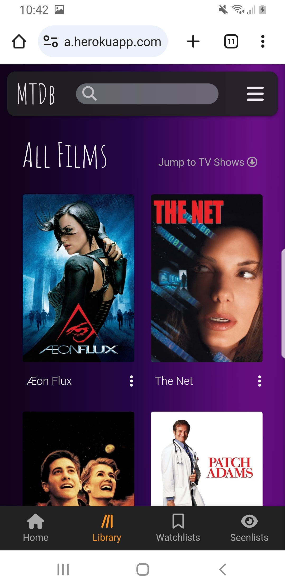    | 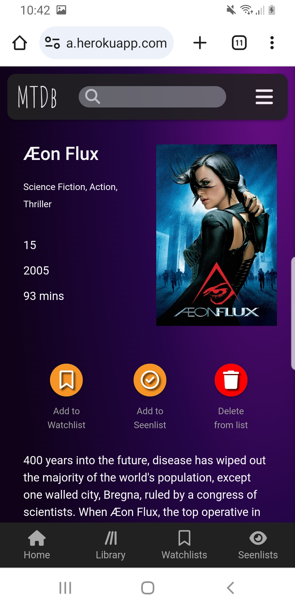    | Works as expected |
| Samsung Galaxy S21 Ultra | 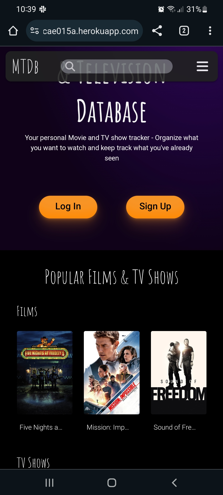   |    |    | Works as expected |
| Samsung Galaxy Tab 4     |   |   |   | Works as expected |

## Lighthouse Audit

I've tested my deployed project using the Lighthouse Audit tool to check for any major issues.

| Page | Size | Screenshot | Notes |
| --- | --- | --- | --- |
| Home | Mobile |  | Some minor warnings |
| Home | Desktop |  | Some minor warnings |
| Library | Mobile |  | Some minor warnings |
| Library | Desktop | 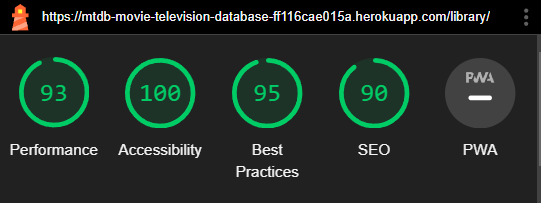 | Few warnings |
| Feature-details | Mobile | 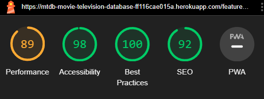 | Some minor warnings |
| Feature-details | Desktop |  | Some minor warnings |
| List | Mobile |  | Some minor warnings |
| List | Desktop |  | Some minor warnings |

## Defensive Programming

Defensive programming was manually tested with the below user acceptance testing:

| Page | User Action | Expected Result | Pass/Fail | Comments |
| --- | --- | --- | --- | --- |
| Home Page | | | | |
| | Click on Logo | Redirection to Home page | Pass | |
| | Click on Home link in navbar | Redirection to Home page | Pass | |
| | Click on Search Bar | cursor enters input field | Pass | |
| | Type a Movie name and Press Enter | Redirection to Search-results page | Pass | |
| | Type a TV show name and Press Enter | Redirection to Search-results page | Pass | |
| | Click on the Nav Bar Login link | Login Modal opens | Pass | |
| | Click on the Login Button | Login Modal opens | Pass | |
| | Click on the Nav Bar Sign Up link | Login Modal opens | Pass | |
| | Click on the Sign Up Button | Login Modal opens | Pass | |
| | Click Library link in navbar | Redirects user to Library page | Pass | |
| | Click Go to Library button | Redirects user to Library page | Pass | |
| | Click Poster in Popular Films & TV Shows section | Redirects user to Search-results page and displays the correct data | Pass | |
| Footer | | | | |
| | Click on Footer Logo | Redirection to Home page | Pass | |
| | Click on Social Icons | Relevant Social Media site opens in a new tab | Pass | |
| Library Page | | | | |
| | Navigate to Library URL when not logged in | Redirection to Home page | Pass | |
| | Click on Home link in sidenav | Redirection to Home page | Pass | |
| | Click on Library link in sidenav | Redirection to Library page | Pass | |
| | Click on Watchlists link in sidenav | Opens Sub Menu | Pass | |
| | Click on Watchlists-Films sub menu link in sidenav | Redirection to List page | Pass | |
| | Click on Watchlists-TV Shows sub menu link in sidenav | Redirection to List page | Pass | |
| | Click on Seenlists link in sidenav | Opens Sub Menu | Pass | |
| | Click on Seenlists-Films sub menu link in sidenav | Redirection to List page | Pass | |
| | Click on Seenlists-TV Shows sub menu link in sidenav | Redirection to List page | Pass | |
| | Click on Jump to TV Shows link | Page scrolls down to TV Shows section | Pass | |
| | Click on Jump to Films link | Page scrolls up to Films section | Pass | |
| | Click on 3 dots next to Film/Show name | Card Menu overlays poster image | Pass | |
| | Click on Edit Details Icon | Redirection to Feature Details page | Pass | |
| | Click on Trash/Delete Icon | Prompts user to confirm deletion | Pass | |
| | Click on No when prompted to confirm deletion | Modal closes and DB entry remains | Pass | |
| | Click on Yes when prompted to confirm deletion | Redirection to Library page and DB entry is deleted | Pass | |
| | Click on Poster | Redirection to Feature Details page | Pass | |
| Search-results Page | | | | |
| | Click on Home link in sidenav | Redirection to Home page | Pass | |
| | Click on Library link in sidenav | Redirection to Library page | Pass | |
| | Click on Watchlists link in sidenav | Opens Sub Menu | Pass | |
| | Click on Watchlists-Films sub menu link in sidenav | Redirection to List page | Pass | |
| | Click on Watchlists-TV Shows sub menu link in sidenav | Redirection to List page | Pass | |
| | Click on Seenlists link in sidenav | Opens Sub Menu | Pass | |
| | Click on Seenlists-Films sub menu link in sidenav | Redirection to List page | Pass | |
| | Click on Seenlists-TV Shows sub menu link in sidenav | Redirection to List page | Pass | |
| | (Non-session user) Click on Library link in sidenav | User Prompted to Log In | Pass | |
| | (Non-session user) Click on Watchlists link in sidenav | Opens Sub Menu & User Prompted to Log In | Pass | |
| | (Non-session user) Click on Watchlists-Films sub menu link in sidenav | User Prompted to Log In | Pass | |
| | (Non-session user) Click on Watchlists-TV Shows sub menu link in sidenav | User Prompted to Log In | Pass | |
| | (Non-session user) Click on Seenlists link in sidenav | Opens Sub Menu & User Prompted to Log In | Pass | |
| | (Non-session user) Click on Seenlists-Films sub menu link in sidenav | User Prompted to Log Ine | Pass | |
| | (Non-session user) Click on Seenlists-TV Shows sub menu link in sidenav | User Prompted to Log In | Pass | |
| | Click on Add to Watchlist link | Redirection to Library and data added to watchlist | Pass | |
| | Click on Add to Seenlist link | Redirection to Library and data added to seenlist | Pass | |
| | Click on Add to Watchlist link when already in Watchlist | Redirection to Library and promted that title is already in Watchlist | Pass | |
| | Click on Add to Seenlist link when already in Seenlist | Redirection to Library and promted that title is already in Seenlist | Pass | |
| | (Non-session user) Click on Add to Watchlist link | User Prompted to Log In | Pass | |
| | (Non-session user) Click on Add to Seenlist link | User Prompted to Log In | Pass | |
| Feature-details Page | | | | |
| | Navigate to Feature Details URL when not logged in | Redirection to Home page | Pass | |
| | Click on Home link in sidenav | Redirection to Home page | Pass | |
| | Click on Library link in sidenav | Redirection to Library page | Pass | |
| | Click on Watchlists link in sidenav | Opens Sub Menu | Pass | |
| | Click on Watchlists-Films sub menu link in sidenav | Redirection to List page | Pass | |
| | Click on Watchlists-TV Shows sub menu link in sidenav | Redirection to List page | Pass | |
| | Click on Seenlists link in sidenav | Opens Sub Menu | Pass | |
| | Click on Seenlists-Films sub menu link in sidenav | Redirection to List page | Pass | |
| | Click on Seenlists-TV Shows sub menu link in sidenav | Redirection to List page | Pass | |
| | Click on Add to Watchlist link | Redirection to Library and data added to watchlist | Pass | |
| | Click on Add to Seenlist link | Redirection to Library and data added to seenlist | Pass | |
| | Click on Add to Watchlist link when already in Watchlist | Redirection to Library and promted that title is already in Watchlist | Pass | |
| | Click on Add to Seenlist link when already in Seenlist | Redirection to Library and promted that title is already in Seenlist | Pass | |
| | Click on Trash/Delete Icon | Prompts user to confirm deletion | Pass | |
| | Click on No when prompted to confirm deletion | Modal closes and DB entry remains | Pass | |
| | Click on Yes when prompted to confirm deletion | Redirection to Library page and DB entry is deleted | Pass | |
| | Click on Star rating Checkbox | Checkbox selected | Pass | |
| | Click on Your Review text box | Cursor enter text area | Pass | |
| | Click on Submit Rating/Review button | User is prompted and rating/review is added to the DB | Pass | |
| | Click on Edit Rating/Review button | Text can be edited | Pass | |
| Film Watchlist Page | | | | |
| | Navigate to Film Watchlist URL when not logged in | Redirection to Home page | Pass | |
| | Click on Home link in sidenav | Redirection to Home page | Pass | |
| | Click on Library link in sidenav | Redirection to Library page | Pass | |
| | Click on Watchlists link in sidenav | Opens Sub Menu | Pass | |
| | Click on Watchlists-Films sub menu link in sidenav | Redirection to List page | Pass | |
| | Click on Watchlists-TV Shows sub menu link in sidenav | Redirection to List page | Pass | |
| | Click on Seenlists link in sidenav | Opens Sub Menu | Pass | |
| | Click on Seenlists-Films sub menu link in sidenav | Redirection to List page | Pass | |
| | Click on Seenlists-TV Shows sub menu link in sidenav | Redirection to List page | Pass | |
| | Click on 3 dots next to Film/Show name | Card Menu overlays poster image | Pass | |
| | Click on Edit Details Icon | Redirection to Feature Details page | Pass | |
| | Click on Trash/Delete Icon | Prompts user to confirm deletion | Pass | |
| | Click on No when prompted to confirm deletion | Modal closes and DB entry remains | Pass | |
| | Click on Yes when prompted to confirm deletion | Redirection to Library page and DB entry is deleted | Pass | |
| | Click on Poster | Redirection to Feature Details page | Pass | |
| TV Watchlist Page | | | | |
| | Navigate to TV Watchlist URL when not logged in | Redirection to Home page | Pass | |
| | Click on Home link in sidenav | Redirection to Home page | Pass | |
| | Click on Library link in sidenav | Redirection to Library page | Pass | |
| | Click on Watchlists link in sidenav | Opens Sub Menu | Pass | |
| | Click on Watchlists-Films sub menu link in sidenav | Redirection to List page | Pass | |
| | Click on Watchlists-TV Shows sub menu link in sidenav | Redirection to List page | Pass | |
| | Click on Seenlists link in sidenav | Opens Sub Menu | Pass | |
| | Click on Seenlists-Films sub menu link in sidenav | Redirection to List page | Pass | |
| | Click on Seenlists-TV Shows sub menu link in sidenav | Redirection to List page | Pass | |
| | Click on 3 dots next to Film/Show name | Card Menu overlays poster image | Pass | |
| | Click on Edit Details Icon | Redirection to Feature Details page | Pass | |
| | Click on Trash/Delete Icon | Prompts user to confirm deletion | Pass | |
| | Click on No when prompted to confirm deletion | Modal closes and DB entry remains | Pass | |
| | Click on Yes when prompted to confirm deletion | Redirection to Library page and DB entry is deleted | Pass | |
| | Click on Poster | Redirection to Feature Details page | Pass | |
| Film Seenlist Page | | | | |
| | Navigate to Film Seenlist URL when not logged in | Redirection to Home page | Pass | |
| | Click on Home link in sidenav | Redirection to Home page | Pass | |
| | Click on Library link in sidenav | Redirection to Library page | Pass | |
| | Click on Watchlists link in sidenav | Opens Sub Menu | Pass | |
| | Click on Watchlists-Films sub menu link in sidenav | Redirection to List page | Pass | |
| | Click on Watchlists-TV Shows sub menu link in sidenav | Redirection to List page | Pass | |
| | Click on Seenlists link in sidenav | Opens Sub Menu | Pass | |
| | Click on Seenlists-Films sub menu link in sidenav | Redirection to List page | Pass | |
| | Click on Seenlists-TV Shows sub menu link in sidenav | Redirection to List page | Pass | |
| | Click on 3 dots next to Film/Show name | Card Menu overlays poster image | Pass | |
| | Click on Edit Details Icon | Redirection to Feature Details page | Pass | |
| | Click on Trash/Delete Icon | Prompts user to confirm deletion | Pass | |
| | Click on No when prompted to confirm deletion | Modal closes and DB entry remains | Pass | |
| | Click on Yes when prompted to confirm deletion | Redirection to Library page and DB entry is deleted | Pass | |
| | Click on Poster | Redirection to Feature Details page | Pass | |
| TV Seenlist Page | | | | |
| | Navigate to TV Seenlist URL when not logged in | Redirection to Home page | Pass | |
| | Click on Home link in sidenav | Redirection to Home page | Pass | |
| | Click on Library link in sidenav | Redirection to Library page | Pass | |
| | Click on Watchlists link in sidenav | Opens Sub Menu | Pass | |
| | Click on Watchlists-Films sub menu link in sidenav | Redirection to List page | Pass | |
| | Click on Watchlists-TV Shows sub menu link in sidenav | Redirection to List page | Pass | |
| | Click on Seenlists link in sidenav | Opens Sub Menu | Pass | |
| | Click on Seenlists-Films sub menu link in sidenav | Redirection to List page | Pass | |
| | Click on Seenlists-TV Shows sub menu link in sidenav | Redirection to List page | Pass | |
| | Click on 3 dots next to Film/Show name | Card Menu overlays poster image | Pass | |
| | Click on Edit Details Icon | Redirection to Feature Details page | Pass | |
| | Click on Trash/Delete Icon | Prompts user to confirm deletion | Pass | |
| | Click on No when prompted to confirm deletion | Modal closes and DB entry remains | Pass | |
| | Click on Yes when prompted to confirm deletion | Redirection to Library page and DB entry is deleted | Pass | |
| | Click on Poster | Redirection to Feature Details page | Pass | |
| Sign Up | | | | |
| | Click on the Nav Bar Sign Up link | Login Modal opens | Pass | |
| | Click on the Sign Up Button | Login Modal opens | Pass | |
| | Enter valid User Name | Field will only accept alphanumeric username | Pass | |
| | Enter valid password | Field will only accept alphanumeric password format | Pass | |
| | Click Register button with valid Username & Password | Redirects user to Library page | Pass | |
| | Click Register button with empty Password field | Prompts for Password | Pass | |
| | Click Register button with empty Username field | Prompts for Username | Pass | |
| | Click Register button with both input fields empty | Prompts for input | Pass | |
| | Click Already Registered link | Opens Log In Modal | Pass | |
| Log In | | | | |
| | Click on the Login link | Redirection to Login page | Pass | |
| | Enter valid User Name | Field will only accept alphanumeric username | Pass | |
| | Enter valid password | Field will only accept alphanumeric password format | Pass | |
| | Click Log In button with valid Username & Password | Redirects user to Library page | Pass | |
| | Click Log In button with empty Password field | Prompts for Password | Pass | |
| | Click Log In button with empty Username field | Prompts for Username | Pass | |
| | Click Log In button with both input fields empty | Prompts for input | Pass | |
| | Click New Here link | Opens Sign Up Modal | Pass | |
| Log Out | | | | |
| | Click Logout button | Redirects user to Home page | Pass |  |

## User Story Testing

| User Story | Screenshot |
| --- | --- |
| As a new site user, I would like to see clear sign-up and login options, so that I can quickly access the sites full functionality. |  |
| As a new site user, I would like to search for movies/shows without signing up, so that I can see what the site has to offer. |  |
| As a new site user, I would like to easily navigate through the site, so that I can quickly find exactly what I'm looking for. |   |
| As a new site user, I would like to responsive design, so that I can view the page on multiple devices. |       |
| As a returning site user, I would like to easily sign up or log in, so that I can access my library and lists. |    |
| As a returning site user, I would like to add movies/shows to my lists, so that I can keep track of what to watch or what I have watched. |  |
| As a returning site user, I would like to view each of my lists individually, so I can choose what to watch. |   |
| As a returning site user, I would like to add my own rating and review to each item in the library. | 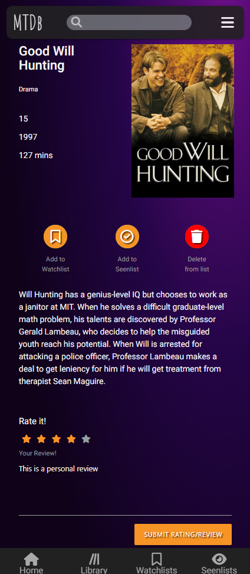 |
| As a returning site user, I would like to delete movies/shows from my lists, so that unwanted items are no longer displayed to me. |  |
 
## Bugs

- Heroku Application Error - `ModuleNotFoundError: No module named 'requests'`

    
    

    - I tried using `pip3 freeze --local > requirements.txt` to update the requirements.txt but it didn't add 'requests' to the file. 
    - To fix this, I manually added `requests==2.26.0` to requirements.txt.

- White Space on mobile devices 

    
    

    - While viewing the home page at different resolutions I found a large area of white space on the right-hand side of screens smaller than 425px.
    I found the source of the problem by using the developer tools in Chrome and deleted different elements one at a time until the white space was gone. 
    By doing this I worked out the problem was within the div with the `.welcome` class and was caused by a large margin style within `.welcome h1`.
    - To fix this, I removed the margin.

- Side Nav position changes on page refresh

    
    

    - In my javascript I am targeting two different sidenav elements. The problem was occuring because the both sidenavs were being targeted by the same class - `.sidenav`. The first sidenav has a property of `edge: "right"`. So on page refresh this property was being applied to both sidennavs causing the position issues on the left sidenav.
    - To fix this, I targeted the left sidnav by its id rather than by classname. 

- Unusual Spacing of cards

    

    - When a page was being populated with a list of films and/or tv shows I was experiencing some odd behaviour when it came to the poster postions on the page. several of the posters would display correctly sitting next to each other and then wrapping to a 'new line' once the container width is exceeded. But some 'new lines' would only display one or two posters and would always be right aligned.
    After some investigation I found a post on [StackOverflow](https://stackoverflow.com/a/69168408) that described a similar issue. The problem being that materialize does not like if cards are not the same height. Although there were no differing height properties being set, I found that the images being supplied by the API were slightly different sizes. 
    - To fix this, I gave the `img` a property of `aspect-ratio: 2 / 3;`.

- Mixed content: insecure Favicon

    

    - To fix this, I changed the `type="image/png"` to `type="image/x-icon"`.

## Unfixed Bugs

There are no remaining bugs that I am aware of.
